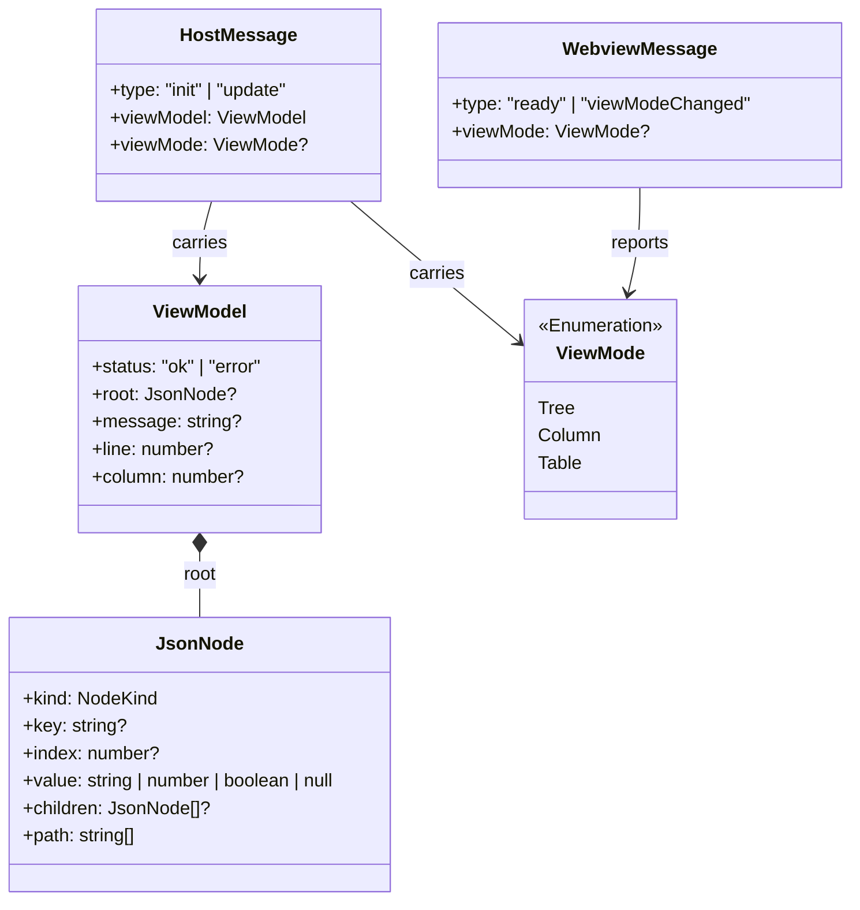
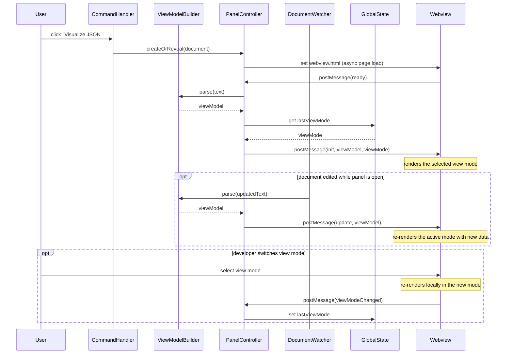

# Design: JSON Visualizer VS Code Extension

<!-- spec-nav:start -->
**Spec navigation:** [State](00_state.md) · [Discovery](01_discovery.md) · [Requirements](02_requirements.md) · [Design](03_design.md) · [Tasks](04_tasks.md) · [Execution](05_execution.md)
<!-- spec-nav:end -->

> [!IMPORTANT]
> Status: **Approved on 2026-08-09**

## Overview

The extension has two cooperating halves that only ever talk through `postMessage`, exactly as
scoped in [`01_discovery.md`](01_discovery.md#chosen-direction). The **Extension Host** (plain
TypeScript, the VS Code Extension API) owns the command/menu contribution, reads the active
`.json`/`.jsonc` document, parses it into a small structured **view model**, and manages one
`WebviewPanel` per visualized document. The **Webview** (Preact, bundled with `esbuild`) owns
nothing but rendering: it receives a view model and renders it as a Tree, Column, or Key-Value/
Table view, styled entirely with VS Code's own theme CSS variables. Neither half ever writes back
to the document — the read-only guarantee (Requirement 9) is architectural, not just a UI
convention: the Webview has no message type that carries an edit, and the Extension Host never
calls `TextEdit`/`workspace.applyEdit` anywhere in this design.

## Architecture

```mermaid
block
  columns 3
  block:editor_ui["VS Code Editor"]
    file[/"Active .json/.jsonc Document"/]
    titleButton["Editor Title: Visualize JSON"]
  end
  block:extension_host["Extension Host"]
    commandHandler["Command Handler"]
    viewModelBuilder["View Model Builder (jsonc-parser)"]
    panelController["Webview Panel Controller"]
    documentWatcher["Document Change Watcher"]
    globalState[("Last View Mode")]
  end
  block:webview_panel["Webview Panel (Preact)"]
    appRoot["App Root"]
    treeView["Tree View"]
    columnView["Column View"]
    tableView["Key-Value/Table View"]
  end
  file-- "read text on open" -->commandHandler
  titleButton-- "click" -->commandHandler
  commandHandler-- "create/reveal panel" -->panelController
  panelController-- "parse text" -->viewModelBuilder
  viewModelBuilder-- "view model" -->panelController
  documentWatcher-- "on text change" -->viewModelBuilder
  panelController-- "read/write lastViewMode" -->globalState
  panelController-- "postMessage init/update" -->appRoot
  appRoot-- "render (Tree mode)" -->treeView
  appRoot-- "render (Column mode)" -->columnView
  appRoot-- "render (Table mode)" -->tableView
```

Five Extension Host modules, one Preact app with three renderer components. Nothing in the
Webview reaches back into VS Code except `acquireVsCodeApi().postMessage`; nothing in the
Extension Host renders UI. This mirrors and refines the block diagram already approved in
discovery, replacing its illustrative node names with the actual module boundaries below. The
Preact-vs-React-vs-vanilla decision itself was made in discovery and is not reopened here.

## Components and Interfaces

### `extension.ts` (activation entry point)

Registers the command and pushes every disposable onto `context.subscriptions`. No logic beyond
wiring.

- `activate(context: vscode.ExtensionContext): void` — calls `registerVisualizeCommand(context)`.

### `commandHandler.ts`

- `registerVisualizeCommand(context: vscode.ExtensionContext): vscode.Disposable` — registers
  `jsonTables.visualize`. On invocation, reads `vscode.window.activeTextEditor.document` and
  calls `PanelController.createOrReveal(context, document)`.
- [`package.json`](../../package.json) contributes the command and its `editor/title` menu entry with
  `"when": "resourceLangId == json || resourceLangId == jsonc"` — **R1.1, R1.2**: VS Code itself
  hides/shows the button per the `when` clause, so no runtime polling is needed. `"group":
  "navigation"` places it beside the existing editor-title icons without touching them.

### `viewModelBuilder.ts`

- `buildViewModel(text: string): ViewModel` — parses `text` with `jsonc-parser`'s `parseTree(text,
  errors)`, which reports parse failures through the `errors: ParseError[]` array it mutates
  (not a return value) rather than throwing. If that array is non-empty, returns `{ status:
  "error", message, line, column }` instead of a partial tree — **R2.1, R2.2, R8.1, R8.5**. Each
  `ParseError` carries only `{ error, offset, length }` — `jsonc-parser` has no offset-to-position
  API (`getLocation(text, offset)` answers a different question: which JSON path segment
  contains that offset, for completion/hover providers, not `{line, column}`). `line`/`column`
  instead come from a small local helper in this same file that counts `\n` characters in `text`
  up to the error's `offset`, keeping `buildViewModel` a pure function with no VS Code API
  dependency.
- Pure function, no VS Code API dependency — directly unit-testable (see Testing Strategy).

### `panelController.ts`, `debounce.ts`, `webviewHtml.ts`

The debounce wrapper and the HTML/CSP template are factored into their own dependency-free
sibling files rather than defined inside `panelController.ts` itself — the same reason
`documentWatcher.ts` takes `vscode.workspace` as a parameter rather than importing `vscode` as a
value: any file that does `import * as vscode from "vscode"` at module scope fails to resolve
under a plain Node.js test process, so the pieces worth unit-testing (timing behavior, CSP shape)
have to live where that import never happens.

- `debounce.ts`: `debounce<Args>(fn, ms): (...args: Args) => void` — the standard trailing-edge
  debounce, generic over its wrapped function's arguments.
- `webviewHtml.ts`: `generateNonce(): string` (16 bytes from `node:crypto`'s `randomBytes`,
  base64-encoded — a background security review of the first draft, which used `Math.random()`,
  flagged it as a weak primitive; `randomBytes` costs nothing extra and removes the ambiguity)
  and `renderWebviewHtml({ scriptUri, styleUri, nonce }): string`, producing the CSP
  `default-src 'none'; script-src 'nonce-<nonce>'; style-src 'nonce-<nonce>'` shell with both the
  nonce'd `<script>` and `<link>` tags.

- `class PanelController` — one instance per visualized `vscode.TextDocument`, keyed by
  `document.uri.toString()` in a module-level `Map` so a second invocation on the same document
  reveals the existing panel instead of creating a duplicate.
  - `static createOrReveal(context, document): void` — looks up or creates a
    `vscode.WebviewPanel` (`enableScripts: true`, `retainContextWhenHidden: true`,
    `localResourceRoots: [Uri.joinPath(context.extensionUri, "dist", "webview")]`) and sets its
    HTML (CSP `default-src 'none'; script-src 'nonce-<nonce>'; style-src 'nonce-<nonce>'`). It
    does **not** call `sendInit` itself — assigning `panel.webview.html` triggers an async page
    load, so a message posted immediately could arrive before `main.tsx` has attached its
    listener. **R1.3, R1.4**: the panel opens in `ViewColumn.Beside`, never replacing the source
    editor.
  - `private sendInit(): void` — builds the initial view model, reads
    `context.globalState.get("jsonTables.lastViewMode", "tree")`, and posts
    `{ type: "init", viewModel, viewMode }`. Called only from `onWebviewMessage` in response to
    the webview's own `{ type: "ready" }`, making the handshake deterministic instead of relying
    on message-delivery timing. **R2.1, R6.2, R6.3**.
  - `private onDocumentChanged(event): void` — subscribed via `documentWatcher.ts`; debounces
    (150 ms) then rebuilds and posts `{ type: "update", viewModel }`. **R8.2, R8.3**.
  - `private onWebviewMessage(message): void` — handles `{ type: "ready" }` by calling
    `sendInit()`, and `{ type: "viewModeChanged", viewMode }` by writing
    `context.globalState.update("jsonTables.lastViewMode", viewMode)`. **R6.2, R6.3**.
  - `dispose(): void` — called from the panel's own `onDidDispose` and from the document watcher
    when the visualized document closes; disposes the change-listener subscription and removes
    the instance from the `Map`. **R8.4**.

### `documentWatcher.ts`

- `watchDocument(workspace, document, onChange, onClose): vscode.Disposable` — thin wrapper
  composing `workspace.onDidChangeTextDocument` (filtered to `event.document === document`) and
  `workspace.onDidCloseTextDocument` (same filter) into the two callbacks `PanelController`
  supplies. `workspace` is the caller-supplied `vscode.workspace` (a `WorkspaceEvents` parameter,
  not a module-scope `import * as vscode from "vscode"`) precisely so this file never attempts
  to resolve the real `vscode` module — which only exists inside the Extension Host process, not
  under a plain Node.js test run — keeping the filtering logic unit-testable with a fake
  workspace object instead of a mocked module.

### Webview: `webview/main.tsx`

- Entry point bundled by `esbuild` to [`dist/webview/main.js`](../../dist/webview/main.js). Calls `acquireVsCodeApi()`,
  attaches `window.addEventListener("message", ...)` to dispatch incoming `HostMessage`s into
  `App`'s state, and calls `render(<App/>, document.body)` (Preact's `render`). Posts
  `{ type: "ready" }` once mounted.

### Webview: `App.tsx`

- `App({ postMessage })`, where `postMessage: (message: WebviewMessage) => void` is injected by
  `main.tsx` (wrapping the real `acquireVsCodeApi().postMessage`) rather than called directly —
  `acquireVsCodeApi` only exists inside a real webview, so injecting it as a prop is what keeps
  `App` unit-testable with a fake, the same dependency-injection reasoning already applied to
  `documentWatcher.ts` and `panelController.ts`'s extracted helpers. `App` owns its own
  `window.addEventListener("message", ...)` internally via a `useEffect` — unlike
  `acquireVsCodeApi`, `window`'s message event can be simulated directly in a jsdom test by
  dispatching a real `MessageEvent`, so no injection is needed for the receiving half.
- Holds `viewModel: ViewModel`, `viewMode: ViewMode`, `expandedPaths: Set<string>`, and Column
  view's `selectedPath: string[]` in `useState`. Renders:
  - an inline error banner when `viewModel.status === "error"` (**R2.3, R8.5**), instead of the
    selected view;
  - otherwise, a view-mode toggle (`Tree` / `Column` / `Table`) plus the matching renderer
    component, passing `viewModel.root` and a shared `expandedPaths: Set<string>` down to
    `TreeView` so the toggle and any global expand/collapse-all control operate at the `App`
    level rather than being duplicated per node (**R3.4, R3.5, R3.6, R6.1**). Expand-all/
    collapse-all call `TreeView.ts`'s exported `collectExpandablePaths`/`defaultExpandedPaths`.
  - On toggle change, posts `{ type: "viewModeChanged", viewMode }` back to the host (**R6.3**).

### Webview: `TreeView.tsx`

- Recursive `TreeNode({ node, path, depth, expandedPaths, onToggle })` — renders a chevron +
  key/index + `{n}`/`[n]` child count for object/array nodes (**R3.1**); leaf values render with a
  `data-kind` attribute mapped to a `--vscode-symbolIcon-*Foreground` CSS variable per type
  (**R3.7**, see Current Technology Evidence). `expandedPaths` defaults every node with
  `depth < 2` to expanded and every deeper node to collapsed (**R3.2, R3.3**); clicking a chevron
  toggles only that node's own path in the set (**R3.4**). `App`'s expand-all/collapse-all
  buttons fill or clear the whole `expandedPaths` set (**R3.5, R3.6**).

### Webview: `ColumnView.tsx`

- `ColumnView({ root, selectedPath })` — derives one `Column` per segment of `selectedPath` plus
  one for the root, each listing its node's entries (**R4.1**). Selecting an object/array entry
  appends to `selectedPath`, opening a new column to the right (**R4.2**); selecting a scalar
  entry instead sets a `detailValue` shown in the rightmost detail pane (**R4.3**). Each `Column`
  tracks its own pixel width in local state, updated by a `pointermove` handler on its resize
  handle (**R4.4**).

### Webview: `TableView.tsx`

- `KeyValueTable({ node })` — for an object node, one row per key (**R5.1**); also the fallback
  for a plain array of scalars (falls back to each element's index as the row label), a shape
  R5.1-R5.3 don't name but that `TableView`'s routing sends here regardless.
- `ArrayGrid({ node })` — for an array-of-objects node, one row per element, unioned column
  headers across elements (**R5.2**).
- Both delegate any cell whose value is itself an object/array to a `PreviewBadge` showing
  `"{n}"`/`"[n]"` instead of expanding it inline (**R5.3**) — clicking a badge is out of scope for
  v1 (no drill-in from Table view; Column view already covers drill-down).
- `TableView({ node })` — the mode-level entry point selecting between `ArrayGrid` (array of
  objects), `KeyValueTable` (everything else with children), or rendering the value directly for
  a scalar root (a document whose top-level value is a bare number/string/boolean/null; found
  during task 6.2's fixture walkthrough — `KeyValueTable` would otherwise render a silently empty
  table with no visible value at all).

## Data Models

`NodeKind` is `"object" | "array" | "string" | "number" | "boolean" | "null"`. `path` is the
sequence of keys/indices from the root, joined into a stable string id (e.g. `"users.0.name"`)
used as the `expandedPaths`/`selectedPath` key in the Webview — never a memory address or array
index alone, so it stays stable across a live-refresh rebuild as long as the document's shape is
unchanged. Both `ViewModel` and the two message envelopes are plain JSON-serializable objects:
everything crossing the `postMessage` boundary is structurally cloned by the Webview API, so no
class instances or functions may appear anywhere inside them.

## Sequence / Flows

Because the Webview never edits the document, this flow cannot form the update loop that VS
Code's [custom editor guide](https://code.visualstudio.com/api/extension-guides/custom-editors)
warns about for editable webviews (`TextDocument` change → webview update → webview-triggered
edit → `TextDocument` change → …): there is no edge in this design from `Webview` back to the
document, only to `PanelController` for view-mode bookkeeping.

## Correctness Properties

### Property 1: Command visibility follows resource language
The "Visualize JSON" editor-title control is visible exactly when the active editor's language
is `json` or `jsonc`, and hidden otherwise, driven entirely by the [`package.json`](../../package.json) `when` clause.
**Validates: Requirements 1.1, 1.2**

### Property 2: Invocation opens a side panel without displacing the source
Activating the control opens or reveals a `WebviewPanel` in `ViewColumn.Beside`; the source
document's own editor is never replaced or closed as a side effect.
**Validates: Requirements 1.3, 1.4**

### Property 3: Initial parse builds a structured view model
`buildViewModel` is called with the document's full current text at panel-open time and produces
either a complete `JsonNode` tree or an error result — never a partial tree silently missing
nodes.
**Validates: Requirements 2.1**

### Property 4: Parse failures always surface as an inline message, on open or refresh
Whenever `buildViewModel` returns `{ status: "error" }` — whether from the initial parse or a
live-refresh reparse — `App` renders the error's message and location inline in place of the
selected view, and never renders a blank panel or throws past the Webview boundary.
**Validates: Requirements 2.2, 2.3, 8.5**

### Property 5: Tree depth-2 default expansion
In Tree view, every node whose path length is less than 2 starts in `expandedPaths`; every node
at depth 2 or greater starts absent from it (collapsed), for any valid document shape.
**Validates: Requirements 3.1, 3.2, 3.3**

### Property 6: Per-node toggle is independent
Toggling one node's entry in `expandedPaths` never adds or removes any other path from the set.
**Validates: Requirements 3.4**

### Property 7: Expand-all/collapse-all are total
Expand-all sets `expandedPaths` to every object/array path in the current tree; collapse-all
clears it to empty — both independent of the tree's current expansion state beforehand.
**Validates: Requirements 3.5, 3.6**

### Property 8: Leaf coloring is type-keyed and theme-driven
Every leaf's rendered color resolves from its `NodeKind` through a fixed `--vscode-symbolIcon-*`
variable, never a literal hex value — so the same document recolors automatically under a
different active theme.
**Validates: Requirements 3.7**

### Property 9: Column drill-down and detail pane are mutually exclusive per selection
Selecting an object/array entry always appends exactly one column; selecting a scalar entry never
appends a column and always populates the detail pane instead.
**Validates: Requirements 4.1, 4.2, 4.3**

### Property 10: Column resize is local and non-destructive
Dragging a column's resize handle changes only that column's stored width; it never mutates
`selectedPath`, `viewModel`, or any other column's width.
**Validates: Requirements 4.4**

### Property 11: Table view chooses row shape by node type, never expanding nested values inline
An object node always renders as one row per key; an array-of-objects node always renders as one
row per element; any cell whose own value is an object/array always renders as a preview badge,
never as an inlined sub-table.
**Validates: Requirements 5.1, 5.2, 5.3**

### Property 12: View-mode switch re-renders the same view model
Changing `viewMode` never triggers a new parse or a new `postMessage` round-trip for the
document's content — only `viewModel.root` already held in `App` state is re-rendered under the
newly selected renderer.
**Validates: Requirements 6.1**

### Property 13: View-mode default is first-Tree, then last-used
The first panel opened in a fresh `globalState` (no `jsonTables.lastViewMode` key) defaults to
`"tree"`; every subsequent panel defaults to whatever value was last written by a
`viewModeChanged` message, regardless of which document it came from.
**Validates: Requirements 6.2, 6.3**

### Property 14: All panel styling resolves through VS Code theme variables
No CSS rule in the Webview bundle sets `color`, `background`, or `border-color` to a literal
value; every such rule resolves through a `--vscode-*` custom property.
**Validates: Requirements 7.1**

### Property 15: Theme changes repaint without a reload
When VS Code's active color theme changes while a panel is open, the panel's `body` class
(`vscode-light`/`vscode-dark`/`vscode-high-contrast`) and the underlying `--vscode-*` variable
values update in place — VS Code itself injects the new values into the existing webview
document — so the rendered colors change without the Extension Host recreating the panel or
resending `viewModel`.
**Validates: Requirements 7.2**

### Property 16: Live refresh rebuilds and redelivers within one debounce window
Any text change to a visualized document while its panel is open results in exactly one
`buildViewModel` call and at most one `{ type: "update" }` message within 150 ms of the last
keystroke in the change burst (debounced, not one call per keystroke).
**Validates: Requirements 8.1, 8.2, 8.3**

### Property 17: Closing the document stops further updates
Once a visualized document's `onDidCloseTextDocument` fires (or its panel is disposed first),
no further `onDidChangeTextDocument` callback for that document reaches `buildViewModel` or
`postMessage` — the subscription is disposed, not merely ignored.
**Validates: Requirements 8.4**

### Property 18: No code path performs a write
No function in `panelController.ts`, `viewModelBuilder.ts`, or any Webview component calls
`vscode.workspace.applyEdit`, `TextEditor.edit`, or any other document-mutating API; every value
rendered in the Webview is inside a non-input, non-`contenteditable` element.
**Validates: Requirements 9.1, 9.2**

### Property 19: Packaging succeeds without publisher configuration
`vsce package` (or `@vscode/vsce`'s programmatic API) produces a `.vsix` from this extension's
[`package.json`](../../package.json) using only fields that don't require a registered publisher id at package time;
installing that `.vsix` activates the same `commandHandler.ts` registration path as the Extension
Development Host.
**Validates: Requirements 10.1, 10.2**

## Error Handling / Edge Cases

- **Malformed JSON/JSONC at open or refresh (R2.2, R8.5):** `jsonc-parser`'s `parseTree` always
  returns a best-effort tree plus an `errors: ParseError[]` array rather than throwing; a non-empty
  `errors` array short-circuits `buildViewModel` to the error branch before any partial tree is
  returned, so the Webview never receives a half-built `JsonNode` tree that could render
  inconsistently.
- **Empty document:** an empty/whitespace-only document parses to zero root nodes; treated as a
  parse error (`"Document is empty"`) rather than a crash, satisfying the same R2.2 contract.
- **Document closed while its panel is still open:** handled by Property 17 — the watcher's
  filtered listener is disposed the moment either the document closes or the panel disposes,
  whichever happens first.
- **Two commands fired for the same document:** `PanelController`'s `Map` lookup means a second
  invocation calls `panel.reveal()` on the existing panel instead of creating a duplicate; no
  requirement currently demands this, but it prevents an unbounded number of listeners
  accumulating on one document.
- **Webview reloaded (e.g. "Reload Webview" from the command palette) with
  `retainContextWhenHidden: true`:** VS Code preserves the underlying document's DOM/JS state, so
  no `init` resend is required; if the Webview process is fully disposed and recreated, the panel's
  `onDidReceiveMessage`-driven `ready` handshake triggers a fresh `sendInit` naturally, without
  special-casing this path.

## Testing Strategy

- **`viewModelBuilder.ts`:** pure-function unit tests (no VS Code API needed) covering an object,
  an array of scalars, an array of objects, deep nesting past depth 2, an empty document, and
  several malformed inputs (unterminated string, trailing comma without `.jsonc` tolerance,
  truncated document) — verifying both the happy-path `JsonNode` shape and the error branch's
  `message`/`line`/`column`. This directly exercises Properties 3, 4, and 5's node-shape half.
- **`documentWatcher.ts`:** unit tests with a fake `vscode.workspace` event emitter, asserting the
  change/close filters only fire callbacks for the matching document (Property 17).
- **Webview components (`TreeView`, `ColumnView`, `TableView`, `App`):** component tests via
  `@testing-library/preact` (or `preact-render-to-string` snapshots) driving `expandedPaths`,
  `selectedPath`, and `viewMode` transitions to cover Properties 5–13 without a live VS Code host.
- **End-to-end (manual, per discovery's approved verification approach):** Extension Development
  Host walkthrough against fixtures for object-only, array-of-objects, deeply nested, scalar-only,
  and malformed JSON, in both a light and a dark theme, covering the full open → view-mode-switch
  → edit-and-refresh → close lifecycle (Properties 1, 2, 14–19).

## Cross-Cutting Risk Gates

- **Security/authorization:** the Webview's CSP (`default-src 'none'; script-src 'nonce-<nonce>';
  style-src 'nonce-<nonce>'`) blocks any script/style not carrying the per-load nonce, and
  `localResourceRoots` is scoped to the extension's own [`dist/webview`](../../dist/webview) directory, so no remote or
  workspace-arbitrary content can load into the panel. There is no authentication/authorization
  surface — the extension only ever reads documents already open in the user's own VS Code
  session. Verification: manual inspection of the generated CSP header in the built HTML.
- **Privacy:** no telemetry, network calls, or persisted data beyond the single
  `jsonTables.lastViewMode` string in `globalState`; the visualized JSON never leaves the Webview
  process. Not applicable beyond that.
- **Accessibility:** Tree/Column/Table controls (chevrons, resize handles, view-mode toggle) are
  implemented as native `<button>`/keyboard-focusable elements rather than click-only `
`s, so
  they inherit VS Code's own focus-ring styling; leaf-value coloring (Property 8) always pairs
  color with the existing text content (key/value), never color alone, so it degrades gracefully
  under a high-contrast theme. Verification: manual keyboard-only walkthrough in the Extension
  Development Host.
- **Performance:** explicitly out of scope per discovery's non-goals — v1 targets small/typical
  files and does no virtualization; the 150 ms live-refresh debounce (Property 16) is the only
  performance-shaped decision in this design, chosen to avoid rebuilding on every keystroke
  without introducing a perceptible lag.
- **Observability:** parse errors and unexpected exceptions in `panelController.ts` are logged to
  a dedicated `vscode.OutputChannel` ("JSON Tables") rather than only shown transiently, so a
  report from personal use has something to inspect after the fact. No metrics/telemetry pipeline
  is in scope.
- **Migration:** not applicable — no persisted data format changes across versions beyond the
  single `lastViewMode` string, which is forward-compatible (an unrecognized value simply falls
  back to `"tree"`).
- **Rollout/rollback:** v1 has no Marketplace rollout; "rollback" is uninstalling the locally
  built `.vsix`, which VS Code supports natively. Revisit this gate once a publisher account and
  `vsce publish` are in place (flagged as an open decision in discovery).

## Current Technology Evidence

| Technology | Context7 identity/source | Exact selected version | Current-doc question | Decision |
|---|---|---|---|---|
| VS Code Extension API | `/websites/code_visualstudio_api` | Extension host targets VS Code `^1.90.0` (Webview/menu APIs used here have been stable since well before this floor) | `editor/title` menu `when`-clause syntax for gating on resource language | Use `"when": "resourceLangId == json \|\| resourceLangId == jsonc"` in `contributes.menus["editor/title"]`, confirmed against the documented `resourceLangId` context key and `||` operator |
| VS Code Extension API | `/websites/code_visualstudio_api` | — | Whether `activationEvents: []` reliably activates an extension implicitly from `contributes.commands` alone (documented as sufficient since VS Code 1.74) | Real-device testing during task 6.2 found the click-to-activate path failed ("command not found") with an empty `activationEvents` array on the user's installed VS Code. Reverted to an explicit `"activationEvents": ["onCommand:jsonTables.visualize"]` — turned out not to be the actual root cause (see the esbuild row below), but remains correct practice on every VS Code version regardless |
| esbuild | `/evanw/esbuild` | `0.28.2` | Why `require("./impl/format")` inside a bundled dependency would fail at runtime with "Cannot find module", despite `bundle: true` | Root cause of the "command not found" bug, found by simulating `activate()` locally against the built bundle: esbuild's `platform: "node"` default `mainFields` is `["main"]` only, which resolved `jsonc-parser` to its UMD build (`main`) instead of its ESM build (`module`). That UMD file's factory receives `require` through a renamed parameter, which defeats esbuild's *literal*-`require()`-only static bundling, leaving one inner require call unresolved at runtime. Fixed by setting `mainFields: ["module", "main"]` on the extension's esbuild config, preferring jsonc-parser's real ESM build (ordinary static imports, fully bundleable) |
| VS Code Extension API | `/websites/code_visualstudio_api` | — | `WebviewPanel` lifecycle: CSP, `localResourceRoots`, `retainContextWhenHidden`, `onDidDispose` cleanup | Confirmed nonce-based CSP pattern, `localResourceRoots` scoping, and the disposal-in-`onDidDispose` pattern used in Components and Interfaces above |
| VS Code Extension API | `/websites/code_visualstudio_api` | — | Syncing a `TextDocument`'s changes to a webview via `onDidChangeTextDocument`, and the update-loop risk that pattern warns about for editable webviews | Confirmed the documented risk applies only when a webview can itself trigger document edits; this design's Webview never calls `applyEdit`, so no anti-loop guard (e.g. dirty-flag suppression) is needed — see Sequence/Flows note |
| VS Code theme colors | `/websites/code_visualstudio_api`, cross-checked against `microsoft/vscode`'s `src/vs/editor/contrib/symbolIcons/browser/symbolIcons.ts` | — | Availability of `--vscode-*` CSS custom properties and `symbolIcon.*Foreground` theme colors inside a webview | Confirmed `--vscode-editor-foreground`-style variables and the `body.vscode-{light,dark,high-contrast}` classes are injected automatically. Context7's excerpt of the theme-color reference page didn't enumerate every individual `symbolIcon.*Foreground` id verbatim (nor did two direct fetches of the reference page itself — the page appears too long for the fetch tool's summarizer to reach that section); fetching the VS Code source file that registers these colors directly confirmed all six ids task 3.5 uses (`nullForeground`, `booleanForeground`, `numberForeground`, `stringForeground`, `objectForeground`, `arrayForeground`) exist exactly as written, each described as appearing "in the outline, breadcrumb, and suggest widget" |
| Preact | `/preactjs/preact-www` | `10.29.8` (current npm `latest` at design time) | Hooks-based state (`useState`) and `render()` entry point for a non-SSR webview bundle | Confirmed API matches the `App`/`TreeView`/`ColumnView`/`TableView` component design above; no server-side rendering or routing needed |
| esbuild | `/evanw/esbuild` | `0.28.2` (current npm `latest` at design time) | Bundling a Preact/JSX entry point (`jsx: "automatic"` or the `h`/`Fragment` pragma) to a single browser-target file for the webview | Confirmed esbuild's `--jsx` and `--jsx-factory`/`--jsx-fragment` (or `jsxImportSource` for automatic mode) options cover Preact's JSX without a separate Babel/TypeScript-JSX toolchain step |

Each row above reflects a library actually consulted through Context7 (`resolve-library-id` then
`query-docs`) at the identity/source shown, before its corresponding decision was made.
`jsonc-parser` (Microsoft's own tolerant JSON/JSONC parser, used inside VS Code itself) was not
found in Context7's index under that name. This design initially misdescribed `getLocation` as an
offset-to-line/column converter; `plan-harden`'s preflight review caught the error against the
package's actual `.d.ts` (`getLocation` resolves a JSON path segment at an offset, for
completion/hover providers — it has no line/column output), so the corrected `viewModelBuilder.ts`
section above uses a local newline-counting helper instead. `parseTree`'s out-parameter `errors`
array is otherwise stable and is exercised directly in the fixtures described under Testing
Strategy.

## Dependency Security Evidence

No dependency resolution has been applied to a manifest yet: this project has no [`package.json`](../../package.json)
or lockfile, and the `dependency-security-audit` tool audits *one exact resolved dependency
snapshot* against an actual manifest+lock, so a real `change`-mode audit cannot run until the
first task that adds these dependencies creates that manifest. Per the `spec-driven` skill's
dependency-evidence policy (`references/dependency-evidence.md`, resolution-change contract),
that task must run the pre/post `dependency-security-audit change` audit itself around the
manifest edit, linking its own `latest.json`/`latest.md` reports — this table only records the
exact versions selected now and an informational (non-project) advisory lookup for each.

| Dependency / target version | Trigger and mode | Evidence | Result and decision |
|---|---|---|---|
| `preact@10.29.8` | dependency selection (this design) / `change` deferred to the task that creates [`package.json`](../../package.json) | Informational OSV lookup (not a project audit): no matching advisory records for this exact version | Selected; the owning task's `Dependency resolution: change` leaf must run the real pre/post `dependency-security-audit change` audit once the manifest exists |
| `esbuild@0.28.2` | dependency selection (this design) / `change` deferred | Informational OSV lookup: no matching advisory records for this exact version | Selected (build-time only, not shipped in the Webview runtime bundle); same deferred-audit requirement |
| `jsonc-parser@3.3.1` | dependency selection (this design) / `change` deferred | Informational OSV lookup: no matching advisory records for this exact version | Selected; same deferred-audit requirement |

Protected-main and release gates are not yet applicable — this feature has no `main`/release
delivery target defined (v1 is a locally installed `.vsix`, per discovery's deferred-publisher
decision); revisit both gates if/when a publish pipeline is introduced.
