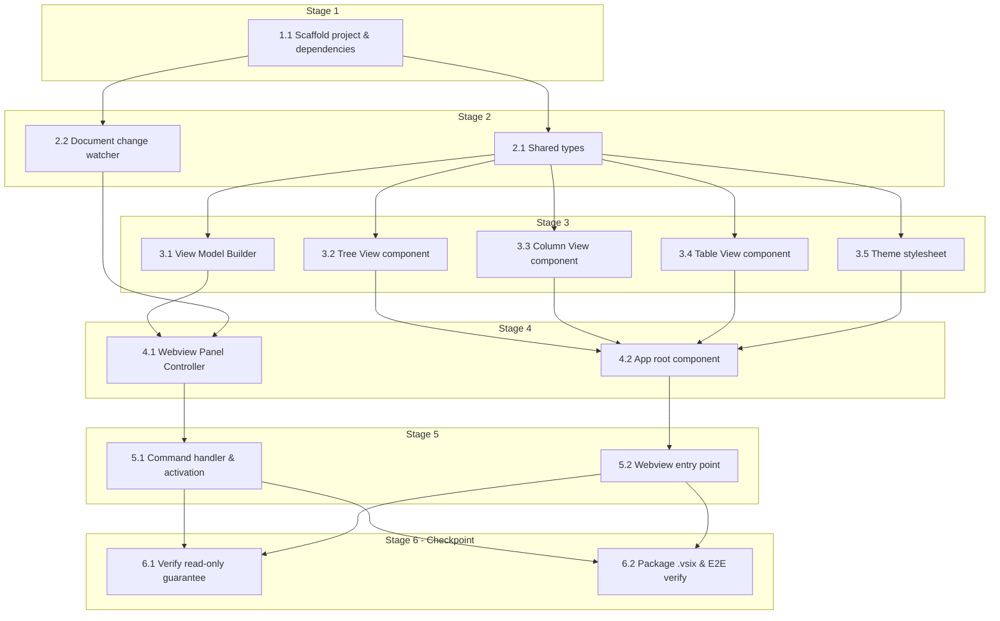

# Tasks: JSON Visualizer VS Code Extension

<!-- spec-nav:start -->
**Spec navigation:** [State](00_state.md) · [Discovery](01_discovery.md) · [Requirements](02_requirements.md) · [Design](03_design.md) · [Tasks](04_tasks.md)
<!-- spec-nav:end -->

> [!WARNING]
> Execute dependency stages in order. Run tasks concurrently only when each is marked
> `parallel-safe`, their ownership is disjoint, and isolated worktrees are available. Stop at
> the Stage 6 checkpoint for human review.

## Stage and Dependency Overview

All of Stage 3 is one parallel wave (five tasks depending only on Stage 2's shared types); Stage
4 and Stage 5 are each a two-task parallel wave; the two Stage 6 tasks form the final checkpoint.

- [ ] 1. Project Scaffolding
  - [ ] 1.1 Scaffold the extension project, add its dependencies, and configure its manifest contributions
    - Create `package.json` (name `json-tables`, `main: "./dist/extension.js"`,
      `engines.vscode: "^1.90.0"`, `scripts.compile`/`scripts.watch`/`scripts.test`/`scripts.package`),
      `tsconfig.json` (strict mode, `target: "ES2022"`, `module: "ESNext"`, no emit — esbuild
      transpiles), and `esbuild.config.mjs` with two build entries: `src/extension.ts` →
      `dist/extension.js` (platform `node`, external `vscode`) and `src/webview/main.tsx` →
      `dist/webview/main.js` (platform `browser`, `jsx: "automatic"`, `jsxImportSource:
      "preact"`, minified in `--production`).
    - Add `dependencies`: `preact@10.29.8`, `jsonc-parser@3.3.1`. Add `devDependencies`:
      `esbuild@0.28.2`, `typescript@7.0.2`, `@types/node@26.2.0`, `@types/vscode@1.125.0`,
      `tsx@4.23.11` (runs the `.ts` test files directly under Node's built-in test runner),
      `@vscode/vsce@3.9.2` (packaging CLI for task 6.2 — no publisher account needed to run
      `vsce package`, only `vsce publish`).
    - In the same `package.json`, add `contributes.commands` for `jsonTables.visualize`
      ("Visualize JSON") and `contributes.menus["editor/title"]` with `"when": "resourceLangId
      == json || resourceLangId == jsonc"`, `"group": "navigation"` — the `when`-clause syntax
      confirmed in [`03_design.md`](03_design.md#current-technology-evidence).
    - Add `.gitignore` (`node_modules/`, `dist/`, `*.vsix`) and `.vscodeignore` (excludes `src/`,
      [`.specs/`](../../.specs), test files from the packaged `.vsix`).
    - **Files:** `package.json`, `package-lock.json`, `tsconfig.json`, `esbuild.config.mjs`,
      `.gitignore`, `.vscodeignore`
    - **Dependency resolution:** change
    - **Dependency delivery:** none
    - **Context7 evidence:** state=pending | identity=/evanw/esbuild | version=0.28.2 | decision=confirm `--jsx`/`jsxImportSource` bundling flags for Preact per [`03_design.md`](03_design.md#current-technology-evidence) before finalizing `esbuild.config.mjs`
    - **Pre-change dependency audit:** state=pending | command=`dependency-security-audit change` | expected_json=`.security/dependency-audit/pre-change.json` | expected_markdown=`.security/dependency-audit/pre-change.md` | review=pending
    - **Resolution edit:** state=pending | expected_files=package.json, package-lock.json
    - **Project tests:** state=pending | expected_evidence=`npm install && npm run compile` exits 0
    - **Post-change dependency audit:** state=pending | command=`dependency-security-audit change` | expected_json=`.security/dependency-audit/post-change.json` | expected_markdown=`.security/dependency-audit/post-change.md` | review=pending
    - **Depends on:** none
    - **Stage:** 1
    - **Interfaces:** Consumes: none (first task in the feature); Produces: `package.json` (npm scripts `compile`, `watch`, `test`, `package`; `jsonTables.visualize` command + `editor/title` menu contribution), `tsconfig.json`, `esbuild.config.mjs` build pipeline producing `dist/extension.js` and `dist/webview/main.js`
    - **Documentation:** no public surface (tooling/manifest config only)
    - **Verification:** `npm install && npm run compile` exits 0 (stub entry files may be empty at this point — the build config itself is what's under test); in the Extension Development Host, opening a `.json` file shows the "Visualize JSON" editor-title icon and opening a `.md` file does not; both pre- and post-change dependency-audit reports reviewed with no unresolved `blocked`/`unavailable`/`invalid` result
    - **Estimated effort:** 1.5-2.5 hours
    - **Risk:** medium; first dependency introduction and lockfile creation for the whole project — a bad pin here affects every later task
    - **Task category:** code_analysis
    - **Delegation:** controller
    - _Requirements: 1.1, 1.2, 10.1_

- [ ] 2. Extension-Host Foundations
  - [ ] 2.1 Define the shared data contract
    - Create `src/shared/types.ts` with `NodeKind`, `JsonNode`, `ViewModel`, `ViewMode`,
      `HostMessage`, `WebviewMessage` exactly as specified in
      [`03_design.md`](03_design.md#data-models)'s Data Models diagram, exported for use by both
      the extension host and webview build targets.
    - **Files:** `src/shared/types.ts`
    - **Dependency resolution:** none
    - **Dependency delivery:** none
    - **Depends on:** 1.1
    - **Stage:** 2
    - **Interfaces:** Consumes: `tsconfig.json` from 1.1; Produces: `NodeKind`, `JsonNode`,
      `ViewModel`, `ViewMode`, `HostMessage`, `WebviewMessage` types importable from
      `src/shared/types.ts`
    - **Documentation:** exported types get one doc comment each stating the field's role in the
      `postMessage` contract (e.g. why `path: string[]` must stay stable across a refresh)
    - **Verification:** `npx tsc --noEmit` passes with these types imported from a scratch file
      in both a `node`-target and `browser`-target compile check
    - **Estimated effort:** 30-45 minutes
    - **Risk:** low; but shared by every later task, so an incorrect shape here compounds
    - **Task category:** code_analysis
    - **Delegation:** parallel-safe
    - _Requirements: 2.1_

  - [ ] 2.2 Implement the document change watcher
    - Create `src/documentWatcher.ts` exporting `watchDocument(document: vscode.TextDocument,
      onChange: () => void, onClose: () => void): vscode.Disposable`, composing
      `vscode.workspace.onDidChangeTextDocument` and `vscode.workspace.onDidCloseTextDocument`,
      each filtered to `event.document === document` before invoking the callback.
    - **Files:** `src/documentWatcher.ts`
    - **Dependency resolution:** none
    - **Dependency delivery:** none
    - **Depends on:** 1.1
    - **Stage:** 2
    - **Interfaces:** Consumes: `vscode.TextDocument` (VS Code API); Produces:
      `watchDocument(document, onChange, onClose): vscode.Disposable`, consumed by task 4.1
    - **Documentation:** one doc comment on `watchDocument` stating the filtering contract and
      why disposal (not just ignoring callbacks) is required
    - **Verification:** unit test (`src/documentWatcher.test.ts`, run via `npm test`) with a fake
      event emitter asserting `onChange`/`onClose` fire only for the matching document and never
      after `dispose()`
    - **Estimated effort:** 45-60 minutes
    - **Risk:** low
    - **Task category:** code_analysis
    - **Delegation:** parallel-safe
    - _Requirements: 8.1, 8.4_

- [ ] 3. Core Rendering and Parsing Logic
  - [ ] 3.1 Implement the View Model Builder
    - Create `src/viewModelBuilder.ts` exporting `buildViewModel(text: string): ViewModel`.
      Consult the Current Technology Evidence entry for `jsonc-parser`'s stability note in
      [`03_design.md`](03_design.md#current-technology-evidence) before finalizing the exact
      `parseTree`/`ParseError`/`getLocation` calls (its API wasn't in Context7's index).
    - Walk `jsonc-parser`'s parse tree into `JsonNode`s (`kind`, `key`/`index`, `value`,
      `children`, `path` built as each node's key/index chain).
    - If `parseTree` reports any `errors`, or the document is empty/whitespace-only, return
      `{ status: "error", message, line, column }` via `getLocation` instead of any partial tree.
    - **Files:** `src/viewModelBuilder.ts`
    - **Dependency resolution:** none
    - **Dependency delivery:** none
    - **Depends on:** 2.1
    - **Stage:** 3
    - **Interfaces:** Consumes: `JsonNode`/`ViewModel`/`NodeKind` types from 2.1,
      `jsonc-parser`'s `parseTree`/`getLocation`; Produces: `buildViewModel(text): ViewModel`,
      consumed by task 4.1
    - **Documentation:** doc comment on `buildViewModel` stating its error-vs-tree contract (never
      returns a partial tree alongside errors)
    - **Verification:** unit tests (`src/viewModelBuilder.test.ts`) covering an object, an array
      of scalars, an array of objects, nesting past depth 2, an empty document, and malformed
      inputs (unterminated string, truncated document), asserting both the `JsonNode` shape and
      the error branch's `message`/`line`/`column`
    - **Estimated effort:** 2-3 hours
    - **Risk:** medium; core parsing logic several later tasks depend on
    - **Task category:** code_analysis
    - **Delegation:** parallel-safe
    - _Requirements: 2.1, 2.2_

  - [ ] 3.2 Implement the Tree View component
    - Create `src/webview/TreeView.tsx` exporting a recursive `TreeNode({ node, path, depth,
      expandedPaths, onToggle })` Preact component: chevron + key/index + `{n}`/`[n]` child-count
      header for object/array nodes; leaf values render with a `data-kind={node.kind}` attribute.
    - Nodes with `path.length < 2` are treated as expanded by default when `expandedPaths` has no
      entry for them yet; `depth >= 2` nodes are treated as collapsed by default. Clicking a
      chevron calls `onToggle(path)`, which the caller (task 4.2) uses to flip only that path's
      membership in `expandedPaths`.
    - **Files:** `src/webview/TreeView.tsx`
    - **Dependency resolution:** none
    - **Dependency delivery:** none
    - **Depends on:** 2.1
    - **Stage:** 3
    - **Interfaces:** Consumes: `JsonNode` type from 2.1; Produces: `TreeNode` component with the
      props above, consumed by task 4.2's `App`
    - **Documentation:** doc comment on `TreeNode` stating the depth-2 default-expansion rule and
      that `expandedPaths` is owned by the caller, not local state
    - **Verification:** component test (`src/webview/TreeView.test.tsx` via
      `preact-render-to-string`) asserting depth-2 default expansion, independent per-node
      toggling, and the `data-kind` attribute per value type
    - **Estimated effort:** 2-3 hours
    - **Risk:** low
    - **Task category:** code_analysis
    - **Delegation:** parallel-safe
    - _Requirements: 3.1, 3.2, 3.3, 3.4, 3.7_

  - [ ] 3.3 Implement the Column View component
    - Create `src/webview/ColumnView.tsx` exporting `ColumnView({ root, selectedPath,
      onSelectPath })`: one `Column` per segment of `selectedPath` (plus the root), each listing
      its node's entries. Selecting an object/array entry calls `onSelectPath([...selectedPath,
      key])`; selecting a scalar entry sets a local `detailValue` shown in the rightmost detail
      pane instead of extending `selectedPath`.
    - Each `Column` tracks its own pixel width in local state, adjusted by a `pointermove`
      handler on a resize handle at its right edge.
    - **Files:** `src/webview/ColumnView.tsx`
    - **Dependency resolution:** none
    - **Dependency delivery:** none
    - **Depends on:** 2.1
    - **Stage:** 3
    - **Interfaces:** Consumes: `JsonNode` type from 2.1; Produces: `ColumnView` component,
      consumed by task 4.2's `App`
    - **Documentation:** doc comment on `ColumnView` stating why scalar selection never extends
      `selectedPath` (mutual exclusivity with the detail pane)
    - **Verification:** component test asserting drill-down appends exactly one column per
      object/array selection, scalar selection never appends a column, and a resize drag updates
      only the dragged column's width
    - **Estimated effort:** 2-3 hours
    - **Risk:** medium; the only component with pointer-drag interaction
    - **Task category:** code_analysis
    - **Delegation:** parallel-safe
    - _Requirements: 4.1, 4.2, 4.3, 4.4_

  - [ ] 3.4 Implement the Key-Value/Table View component
    - Create `src/webview/TableView.tsx` exporting `KeyValueTable({ node })` (one row per key for
      an object node) and `ArrayGrid({ node })` (one row per element, column headers unioned
      across elements, for an array-of-objects node).
    - Any cell whose value is itself an object/array renders a `PreviewBadge` (`"{n}"`/`"[n]"`)
      instead of the nested content.
    - **Files:** `src/webview/TableView.tsx`
    - **Dependency resolution:** none
    - **Dependency delivery:** none
    - **Depends on:** 2.1
    - **Stage:** 3
    - **Interfaces:** Consumes: `JsonNode` type from 2.1; Produces: `KeyValueTable`, `ArrayGrid`
      components, consumed by task 4.2's `App`
    - **Documentation:** doc comment stating the object-vs-array-of-objects row-shape contract and
      why nested values always render as a badge, never inline
    - **Verification:** component test covering a plain object, an array of objects with
      heterogeneous keys (union headers), and a nested object/array cell rendering as a badge
    - **Estimated effort:** 2-3 hours
    - **Risk:** low
    - **Task category:** code_analysis
    - **Delegation:** parallel-safe
    - _Requirements: 5.1, 5.2, 5.3_

  - [ ] 3.5 Implement the theme stylesheet
    - Create `src/webview/theme.css` mapping each `NodeKind` value to a
      `--vscode-symbolIcon-*Foreground` variable (verify the exact per-kind id, e.g.
      `symbolIcon.nullForeground`/`numberForeground`/`stringForeground`/`booleanForeground`,
      against `code.visualstudio.com/api/references/theme-color` as flagged in
      [`03_design.md`](03_design.md#current-technology-evidence), since Context7 confirmed the
      `symbolIcon` category but not every individual id verbatim). Every other rule (background,
      border, general foreground) resolves through a `--vscode-editor-*`/`--vscode-panel-*`
      variable — no rule may set a literal color value.
    - **Files:** `src/webview/theme.css`
    - **Dependency resolution:** none
    - **Dependency delivery:** none
    - **Depends on:** 2.1
    - **Stage:** 3
    - **Interfaces:** Consumes: `NodeKind` type from 2.1 (as the `data-kind` values TreeView
      already emits); Produces: `theme.css` selectors keyed on `[data-kind=...]`, imported by
      task 5.2's `main.tsx`
    - **Documentation:** no public surface (stylesheet); one top-of-file comment listing the
      confirmed `symbolIcon.*Foreground` ids and the date they were checked against the VS Code
      theme-color reference
    - **Verification:** grep review confirming no `color`/`background`/`border-color` rule in the
      file uses a literal value instead of a `var(--vscode-*)`; manual check in both a light and
      dark built-in VS Code theme during task 6.2's walkthrough
    - **Estimated effort:** 1-2 hours
    - **Risk:** low
    - **Task category:** quick_lookup
    - **Delegation:** parallel-safe
    - _Requirements: 3.7, 7.1, 7.2_

- [ ] 4. Orchestration
  - [ ] 4.1 Implement the Webview Panel Controller
    - Create `src/panelController.ts` exporting `class PanelController` (module-level `Map<string,
      PanelController>` keyed by `document.uri.toString()`):
      `static createOrReveal(context, document)`, `private sendInit()`, `private
      onDocumentChanged()` (150 ms debounce), `private onWebviewMessage(message)`, `dispose()`.
    - `createOrReveal` creates the panel in `vscode.ViewColumn.Beside` with `enableScripts: true`,
      `retainContextWhenHidden: true`, `localResourceRoots: [Uri.joinPath(context.extensionUri,
      "dist", "webview")]`, and HTML with a nonce-based CSP (`default-src 'none'; script-src
      'nonce-<nonce>'; style-src 'nonce-<nonce>'`) — confirm this exact pattern against
      [`03_design.md`](03_design.md#current-technology-evidence) before writing it.
    - `sendInit` calls `buildViewModel`, reads `context.globalState.get("jsonTables.lastViewMode",
      "tree")`, and posts `{ type: "init", viewModel, viewMode }`.
    - `onDocumentChanged` (wired through task 2.2's `watchDocument`) rebuilds via
      `buildViewModel` and posts `{ type: "update", viewModel }`.
    - `onWebviewMessage` handles `{ type: "viewModeChanged", viewMode }` by writing
      `context.globalState.update("jsonTables.lastViewMode", viewMode)`.
    - `dispose()` — called from the panel's own `onDidDispose` and from `watchDocument`'s
      `onClose` — disposes the watcher subscription and removes the map entry.
    - **Files:** `src/panelController.ts`
    - **Dependency resolution:** none
    - **Dependency delivery:** none
    - **Depends on:** 3.1, 2.2
    - **Stage:** 4
    - **Interfaces:** Consumes: `buildViewModel(text): ViewModel` from 3.1, `watchDocument(...)`
      from 2.2, `HostMessage`/`WebviewMessage` types from 2.1; Produces:
      `PanelController.createOrReveal(context, document): void`, consumed by task 5.1
    - **Documentation:** doc comments on the class and each public method stating the lifecycle
      contract (one instance per document, disposal ordering, why the panel is never in
      `ViewColumn.Active`)
    - **Verification:** unit test for the 150 ms debounce using fake timers (one `buildViewModel`
      call per burst, not per keystroke); manual Extension Development Host check that a second
      invocation on the same document reveals rather than duplicates the panel, and that the
      CSP header is present in the rendered HTML
    - **Estimated effort:** 3-4 hours
    - **Risk:** high; central orchestration module, and CSP correctness is a security property
    - **Task category:** heavy_reasoning
    - **Delegation:** parallel-safe
    - _Requirements: 1.3, 1.4, 2.1, 6.2, 6.3, 8.1, 8.2, 8.4_

  - [ ] 4.2 Implement the App root component
    - Create `src/webview/App.tsx` exporting `App`: holds `viewModel: ViewModel`, `viewMode:
      ViewMode`, and `expandedPaths: Set<string>` in `useState`.
    - Renders an inline error banner (message + line/column) when `viewModel.status === "error"`,
      in place of the selected view.
    - Otherwise renders the Tree/Column/Table toggle plus the matching component from 3.2/3.3/3.4,
      passing `expandedPaths` and toggle callbacks down to `TreeView`.
    - Expand-all/collapse-all buttons fill or clear `expandedPaths` with every object/array path
      in the current tree.
    - Listens for `window.addEventListener("message", ...)` dispatching incoming `HostMessage`s
      (`init`/`update`) into state; posts `{ type: "viewModeChanged", viewMode }` when the toggle
      changes.
    - **Files:** `src/webview/App.tsx`
    - **Dependency resolution:** none
    - **Dependency delivery:** none
    - **Depends on:** 3.2, 3.3, 3.4, 3.5
    - **Stage:** 4
    - **Interfaces:** Consumes: `TreeNode`/`ColumnView`/`KeyValueTable`/`ArrayGrid` components
      from 3.2-3.4, `theme.css` from 3.5, `HostMessage`/`WebviewMessage`/`ViewModel`/`ViewMode`
      types from 2.1; Produces: `App` component, mounted by task 5.2's `main.tsx`
    - **Documentation:** doc comment on `App` stating the message-handling contract (which
      incoming `type`s it accepts, which outgoing `type`s it emits)
    - **Verification:** component test covering: error-state renders the inline banner and no
      view; `init`/`update` messages update `viewModel`; toggling view mode re-renders without
      re-requesting data; expand-all/collapse-all mutate the full `expandedPaths` set
    - **Estimated effort:** 2-3 hours
    - **Risk:** medium; composes every other webview component and owns all client-side state
    - **Task category:** code_analysis
    - **Delegation:** parallel-safe
    - _Requirements: 2.3, 3.5, 3.6, 6.1, 6.3, 8.3, 8.5, 9.1_

- [ ] 5. Wiring
  - [ ] 5.1 Implement the command handler and extension activation
    - Create `src/commandHandler.ts` exporting `registerVisualizeCommand(context):
      vscode.Disposable`, registering `jsonTables.visualize` (id from task 1.1's manifest entry);
      on invocation, reads `vscode.window.activeTextEditor?.document` and, if present, calls
      `PanelController.createOrReveal(context, document)`.
    - Create `src/extension.ts` exporting `activate(context)`, calling
      `context.subscriptions.push(registerVisualizeCommand(context))`.
    - **Files:** `src/commandHandler.ts`, `src/extension.ts`
    - **Dependency resolution:** none
    - **Dependency delivery:** none
    - **Depends on:** 4.1
    - **Stage:** 5
    - **Interfaces:** Consumes: `PanelController.createOrReveal` from 4.1, the
      `jsonTables.visualize` command id contributed in 1.1; Produces: `activate(context)` as the
      `package.json` `main` entry point's exported activation function
    - **Documentation:** doc comment on `activate` and `registerVisualizeCommand` stating the
      activation contract (idempotent registration, no-op when there is no active editor)
    - **Verification:** Extension Development Host manual check — command runs from both the
      editor-title button and the Command Palette and opens the panel in both cases
    - **Estimated effort:** 45-60 minutes
    - **Risk:** low
    - **Task category:** quick_lookup
    - **Delegation:** parallel-safe
    - _Requirements: 1.3, 10.2_

  - [ ] 5.2 Implement the webview entry point
    - Create `src/webview/main.tsx`: calls `acquireVsCodeApi()`, imports `theme.css`, attaches
      `window.addEventListener("message", ...)` before mount so no early `init` message is
      missed, calls Preact's `render(<App/>, document.body)`, then posts `{ type: "ready" }`.
    - **Files:** `src/webview/main.tsx`
    - **Dependency resolution:** none
    - **Dependency delivery:** none
    - **Depends on:** 4.2
    - **Stage:** 5
    - **Interfaces:** Consumes: `App` component from 4.2, `acquireVsCodeApi()` (VS Code webview
      API); Produces: the `dist/webview/main.js` bundle entry point task 4.1's `panelController.ts`
      HTML references
    - **Documentation:** doc comment stating why the message listener attaches before `render`
      (so a fast `init` message from the host is never dropped)
    - **Verification:** Extension Development Host manual check — panel shows the Tree view (or
      the last-used mode) immediately on open, with no visible flash of empty content
    - **Estimated effort:** 30-45 minutes
    - **Risk:** low
    - **Task category:** quick_lookup
    - **Delegation:** parallel-safe
    - _Requirements: 6.2_

- [ ] 6. Checkpoint — feature complete, ready for personal-use packaging
  - [ ] 6.1 Verify the read-only guarantee across the whole codebase
    - Grep `src/` for `applyEdit`, `TextEditor.edit`, `WorkspaceEdit`, and `contenteditable`;
      confirm zero matches outside of comments/tests.
    - Manually inspect every rendered value site in `TreeView.tsx`, `ColumnView.tsx`, and
      `TableView.tsx` to confirm none is an `<input>`, `<textarea>`, or `contenteditable`
      element.
    - **Files:** none (verification only; no files owned)
    - **Dependency resolution:** none
    - **Dependency delivery:** none
    - **Depends on:** 5.1, 5.2
    - **Stage:** 6
    - **Interfaces:** Consumes: the completed source tree from tasks 2.1-5.2; Produces: a pass/fail
      verification record for Property 18 in [`03_design.md`](03_design.md#correctness-properties)
    - **Documentation:** no public surface (review task)
    - **Verification:** the grep above returns no matches, and the manual element inspection
      confirms no editable element exists in any of the three view components
    - **Estimated effort:** 30-45 minutes
    - **Risk:** medium; a failure here means the read-only architectural guarantee was violated
      somewhere upstream and the offending task must be revisited
    - **Task category:** review
    - **Delegation:** parallel-safe
    - _Requirements: 9.1, 9.2_

  - [ ] 6.2 Package the extension and run the end-to-end walkthrough
    - Add `README.md`, `LICENSE`, and an icon referenced from `package.json`'s `icon` field (none
      of these require a registered publisher id).
    - Run `npm run compile` then `npx vsce package` to produce a `.vsix`; install it into a local
      VS Code instance via "Install from VSIX...".
    - Manually walk through: object-only, array-of-objects, deeply nested (depth > 2), scalar-only,
      and malformed JSON fixtures, in both a light and a dark built-in theme, exercising the full
      open → view-mode-switch → edit-and-refresh → close lifecycle, from both the Extension
      Development Host and the installed `.vsix`.
    - **Files:** `README.md`, `LICENSE`, icon asset (path TBD by author), `package.json` (add
      `icon`/`repository`/`license` fields)
    - **Dependency resolution:** none
    - **Dependency delivery:** none
    - **Depends on:** 5.1, 5.2
    - **Stage:** 6
    - **Interfaces:** Consumes: the completed, compiled extension from tasks 1.1-5.2; Produces: an
      installable `.vsix` file and a recorded walkthrough result
    - **Documentation:** `README.md` documents the command, the three view modes, and that no
      publisher account/Marketplace listing exists yet (per discovery's deferred-publisher
      decision)
    - **Verification:** `npx vsce package` exits 0 without a publisher-account error; the
      installed `.vsix` shows the same editor-title button and panel behavior as the Extension
      Development Host across every fixture/theme combination above
    - **Estimated effort:** 1.5-2.5 hours
    - **Risk:** low; packaging-only, no new application logic
    - **Task category:** review
    - **Delegation:** parallel-safe
    - _Requirements: 10.1, 10.2_

## Delivery Schedule

| Stage | Task | Estimate | Depends on | Critical path |
|---:|---|---|---|---|
| 1 | 1.1 | 1.5-2.5 hours | none | yes |
| 2 | 2.1 | 30-45 minutes | 1.1 | yes |
| 2 | 2.2 | 45-60 minutes | 1.1 | yes |
| 3 | 3.1 | 2-3 hours | 2.1 | yes |
| 3 | 3.2 | 2-3 hours | 2.1 | no |
| 3 | 3.3 | 2-3 hours | 2.1 | no |
| 3 | 3.4 | 2-3 hours | 2.1 | no |
| 3 | 3.5 | 1-2 hours | 2.1 | no |
| 4 | 4.1 | 3-4 hours | 3.1, 2.2 | yes |
| 4 | 4.2 | 2-3 hours | 3.2, 3.3, 3.4, 3.5 | no |
| 5 | 5.1 | 45-60 minutes | 4.1 | yes |
| 5 | 5.2 | 30-45 minutes | 4.2 | no |
| 6 | 6.1 | 30-45 minutes | 5.1, 5.2 | no |
| 6 | 6.2 | 1.5-2.5 hours | 5.1, 5.2 | yes |

No calendar dates are committed — durations only, per task estimate. The critical path (1.1 →
2.1/2.2 → 3.1 → 4.1 → 5.1 → 6.2) totals roughly 9.5-13.5 hours; Stage 3's five-way and Stage 4/5's
two-way parallel waves can shorten wall-clock time if run concurrently in isolated worktrees.
