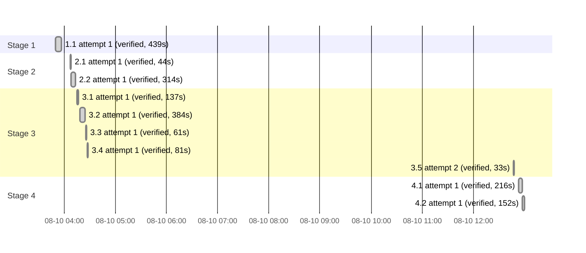

# Execution Ledger: JSON Visualizer VS Code Extension

<!-- spec-nav:start -->
**Spec navigation:** [State](00_state.md) · [Discovery](01_discovery.md) · [Requirements](02_requirements.md) · [Design](03_design.md) · [Tasks](04_tasks.md) · [Execution](05_execution.md)
<!-- spec-nav:end -->

## Preflight

- Base branch: `main`, base commit: the initial [`.specs/`](../../.specs) commit. Working checkout was `main`
  (protected); created `feature/json-visualizer` for all implementation work rather than editing
  `main` directly.
- Baseline: no existing build/test tooling in the repository (brand-new project) — nothing to
  run as a pre-existing-failure baseline.
- Self-hardening preflight: artifacts digest (sha256 of [01_discovery.md](01_discovery.md)+[02_requirements.md](02_requirements.md)+
  [03_design.md](03_design.md)+[04_tasks.md](04_tasks.md)) `296235e7701f26dd5f21f105b80e2fa7188e1f9d2aeb8b5764effd7cc9d7fa02`.
  Classified **thorough** (the plan includes a dependency-resolution task and a CSP/webview
  security-sensitive task). Resolved fan-out: 2 reviewers, `balanced` tier, `high` reasoning.
  `plan-harden` findings and resolution are recorded under Checkpoints below.

## Active Wave

| Task | Stage | Mode | Branch / worktree | State |
|---|---:|---|---|---|
| 1.1 | 1 | sequential | `feature/json-visualizer` (main worktree) | dispatched |

## Baseline

| Revision | Command | Exit | Pre-existing failures |
|---|---|---:|---|
| (initial commit) | none (no build/test tooling existed yet) | — | none |

## Execution Timing

### Run Intervals
| Run ID | Started UTC | Stopped UTC | Elapsed Seconds | Outcome |
|---|---|---|---:|---|
| run-20260810T034356Z | 2026-08-10T03:43:56Z | unknown | unknown | interrupted |
| run-20260810T124656Z | 2026-08-10T12:46:56Z | pending | pending | active |

### Task Attempt Intervals
| Run ID | Stage/Wave | Task | Attempt | Started UTC | Stopped UTC | Elapsed Seconds | Outcome |
|---|---|---|---:|---|---|---:|---|
| run-20260810T034356Z | Stage 1 | 1.1 | 1 | 2026-08-10T03:49:55Z | 2026-08-10T03:57:14Z | 439 | verified |
| run-20260810T034356Z | Stage 2 | 2.1 | 1 | 2026-08-10T04:07:06Z | 2026-08-10T04:07:50Z | 44 | verified |
| run-20260810T034356Z | Stage 2 | 2.2 | 1 | 2026-08-10T04:07:50Z | 2026-08-10T04:13:04Z | 314 | verified |
| run-20260810T034356Z | Stage 3 | 3.1 | 1 | 2026-08-10T04:14:51Z | 2026-08-10T04:17:08Z | 137 | verified |
| run-20260810T034356Z | Stage 3 | 3.2 | 1 | 2026-08-10T04:18:23Z | 2026-08-10T04:24:47Z | 384 | verified |
| run-20260810T034356Z | Stage 3 | 3.3 | 1 | 2026-08-10T04:25:25Z | 2026-08-10T04:26:26Z | 61 | verified |
| run-20260810T034356Z | Stage 3 | 3.4 | 1 | 2026-08-10T04:27:06Z | 2026-08-10T04:28:27Z | 81 | verified |
| run-20260810T034356Z | Stage 3 | 3.5 | 1 | 2026-08-10T04:28:27Z | unknown | unknown | interrupted |
| run-20260810T124656Z | Stage 3 | 3.5 | 2 | 2026-08-10T12:46:56Z | 2026-08-10T12:47:29Z | 33 | verified |
| run-20260810T124656Z | Stage 4 | 4.1 | 1 | 2026-08-10T12:53:16Z | 2026-08-10T12:56:52Z | 216 | verified |
| run-20260810T124656Z | Stage 4 | 4.2 | 1 | 2026-08-10T12:57:21Z | 2026-08-10T12:59:53Z | 152 | verified |

### Execution Gantt

Run `run-20260810T034356Z` and task 3.5's first attempt were left open across a session pause
between roughly 04:29 and 12:46 UTC; both are recorded `interrupted` with unknown duration
(never fabricated) rather than shown as multi-hour bars. Work resumed as run
`run-20260810T124656Z`, and task 3.5 completed on its second attempt.

## Checkpoints

- Self-hardening preflight (`plan-harden`, thorough/2-reviewer, `balanced`/`high`) reviewed
  [`03_design.md`](03_design.md) and [`04_tasks.md`](04_tasks.md) before any implementation edit.
  Three CERTAIN findings, all applied under delegated repair authority (task/design-internal
  fixes, no requirement or product-behavior change):
  1. Task 1.1's dependency list omitted a component-testing/DOM package that tasks 3.2/3.3/4.2's
     own Verification fields required (interactive click/pointer-drag simulation, not achievable
     with a static `preact-render-to-string` snapshot). Added `@testing-library/preact@3.2.4` +
     `jsdom@30.0.1` to task 1.1 and updated the three tasks' Verification wording to match.
  2. Task 4.1's CSP webview HTML generation never accounted for how `theme.css` (imported by
     task 5.2's `main.tsx`) actually reaches the page under `default-src 'none'`. Added an
     explicit sub-step: convert [`dist/webview/main.js`](../../dist/webview/main.js)/`main.css` via
     `webview.asWebviewUri(...)` and link the CSS with a nonce-carrying `<link>` tag.
  3. [03_design.md](03_design.md) and task 3.1 both misdescribed `jsonc-parser`'s `getLocation` as an
     offset-to-line/column converter; it actually resolves a JSON path segment at an offset (for
     completion/hover), and `ParseError` only carries `{error, offset, length}`. Corrected both
     documents to derive `line`/`column` from a local newline-counting helper instead, and fixed
     the `parseTree(text, errors)` out-parameter description (errors is a mutated argument, not
     a return value).
  All three fixes independently re-reviewed against 02_requirements.md's 35 criteria (no
  citations changed), navigation regenerated, and `spec-check.py --ready` re-run clean (35
  requirements traced, 14 tasks, 6 stages, `ready: ["1.1"]`). Discovery/Requirements/Design/Tasks
  gates retained as `approved` in [`00_state.md`](00_state.md).

## Integration Decision

- Status: pending
- Base: `main`
- Result: —
- Post-integration verification: pending
